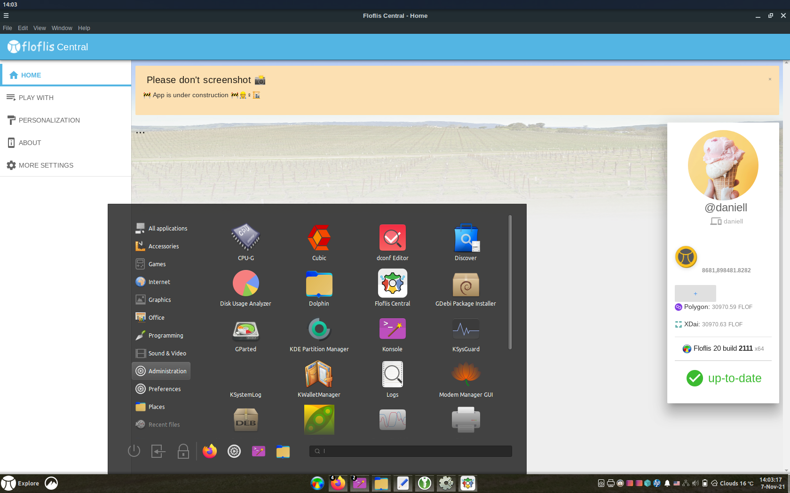
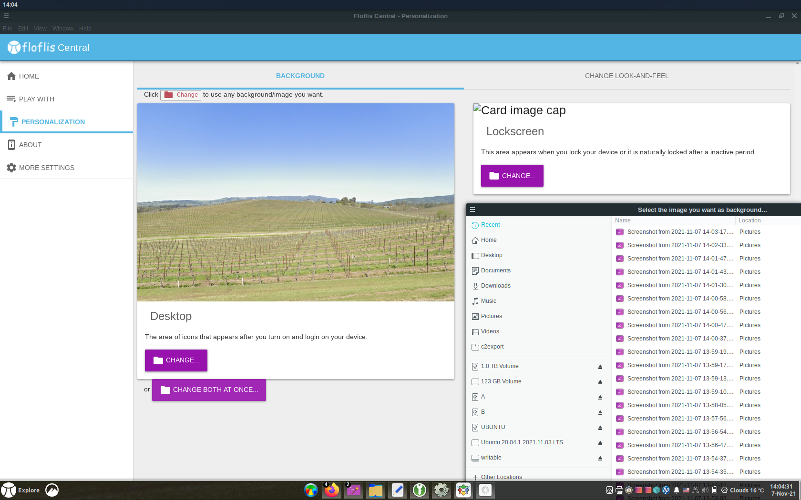

<h1>Floflis Central</h1>

## Introduction

**Note**: this documentation is yet a draft, as Floflis Grass/Base are't available yet.

More than a settings aggregator; its a dashboard for your web3 profile.

Floflis Central is the heart of the current Floflis.

## Setup (draft, outdated)

No need to setup Floflis Central; it already ships with Floflis and automatically starts.

After the classical Debian/Ubuntu installation, on first boot, Floflis Central installs all core settings and components.

Instead of storing user password, it asks password for every sensible operation.

This is an autostart app, where users can read useful information and manage Floflis.

## Source

The source-code of Floflis Central can be found <a href="https://github.com/Floflis/Floflis-Central" target="_blank">here</a>
