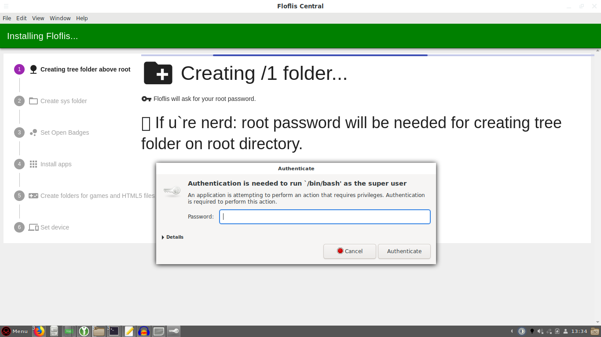
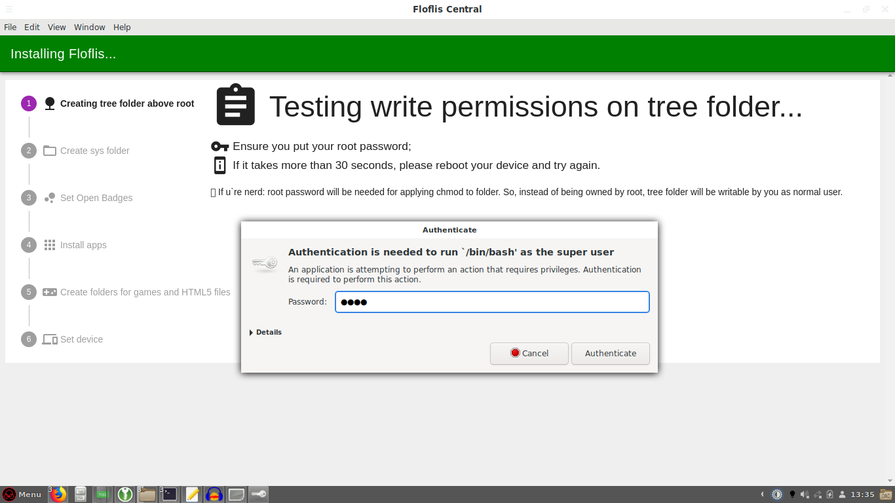

## Introduction

Floflis Central is the heart of the actual Floflis.

This is more than a simple control panel/settings app; the app never thought to be a need on daily use.

## Setup

No need to setup Floflis Central; it already ships with Floflis and automatically starts.

After the classical Debian/Ubuntu installation, on first boot, Floflis Central installs all core settings and components.

Instead of storing user password, it asks for password for every sensible operation.

This is a autostart app, where users can read useful informations and manage Floflis.
