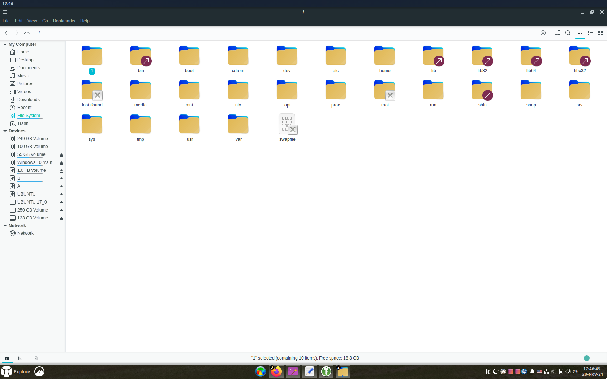
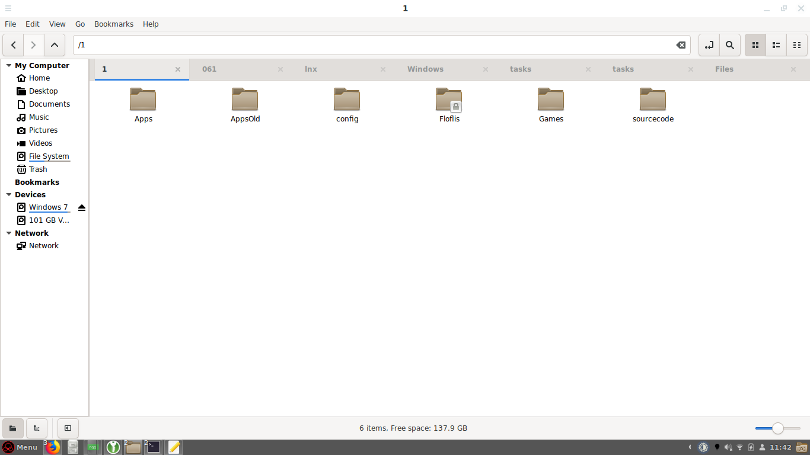
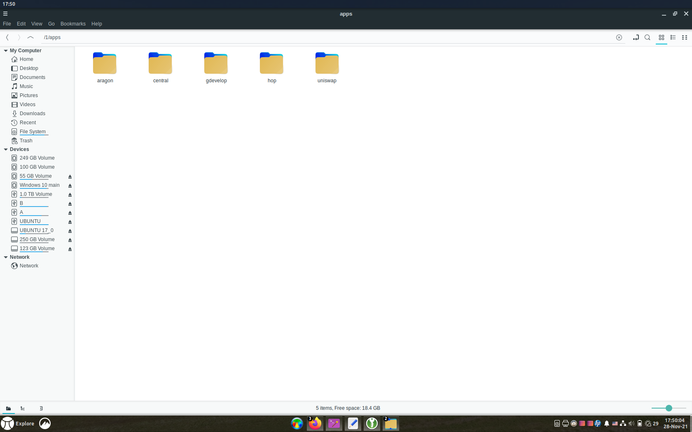
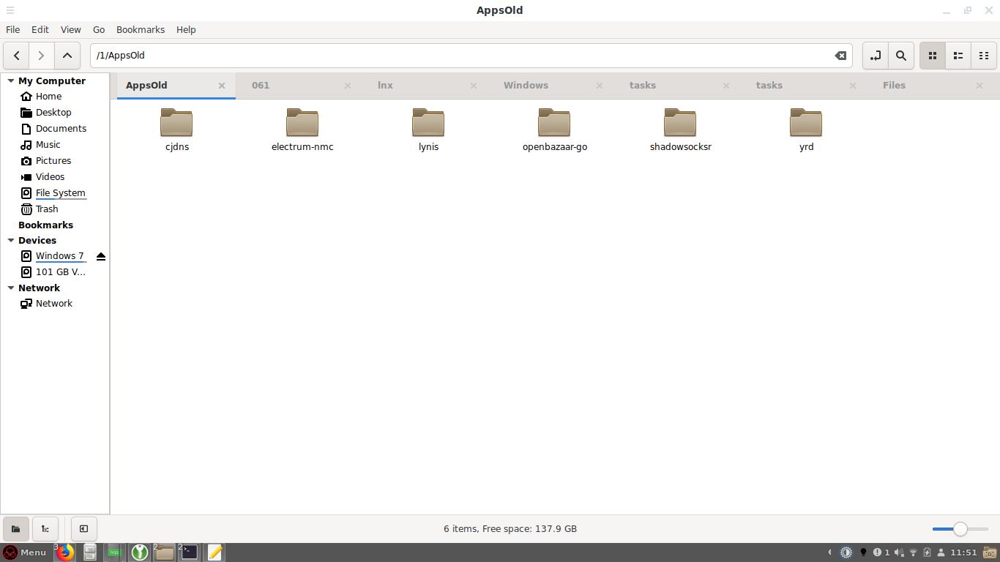
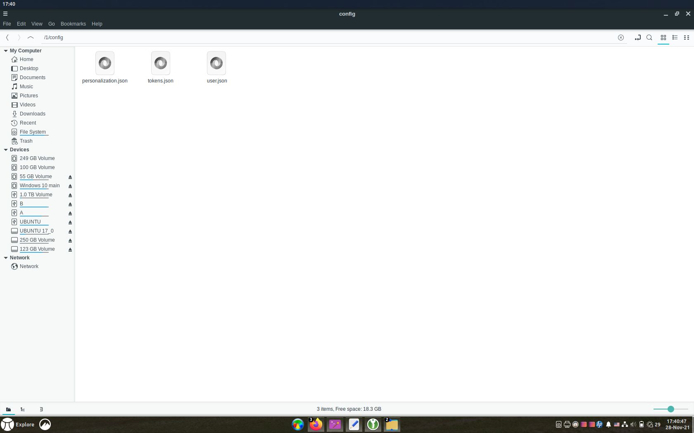
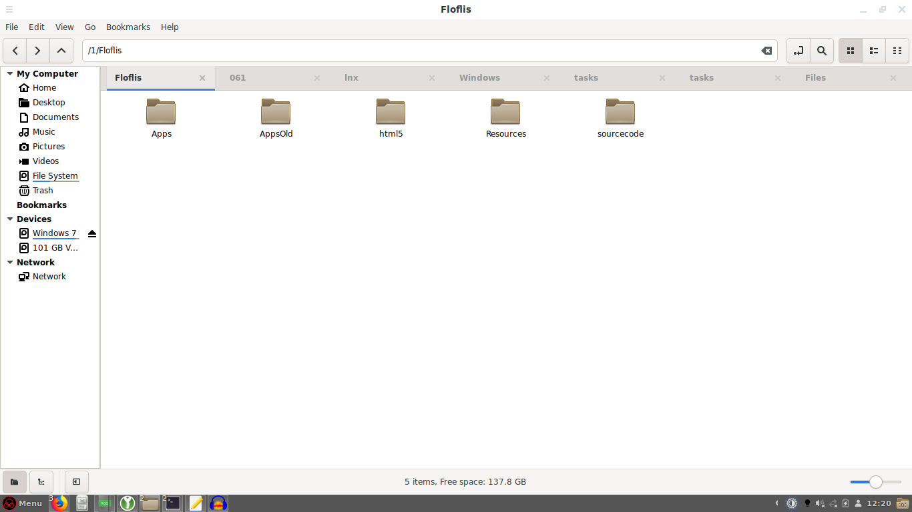
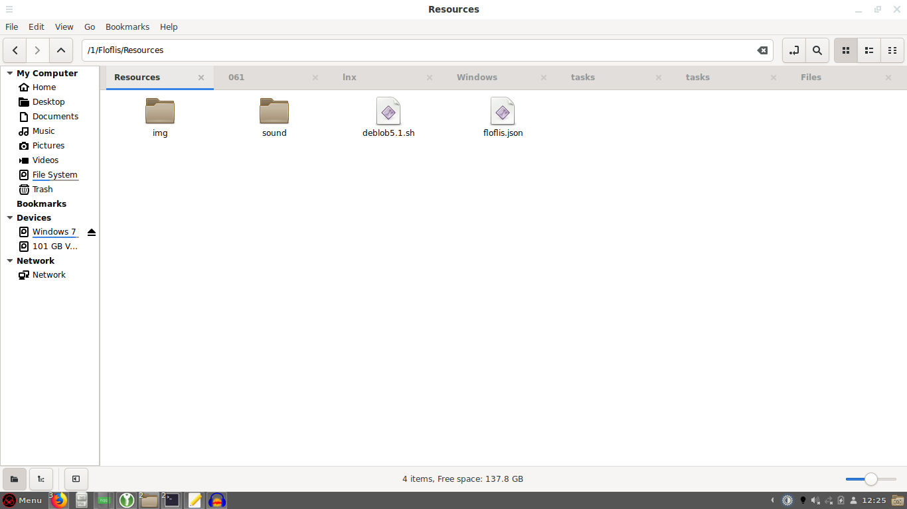
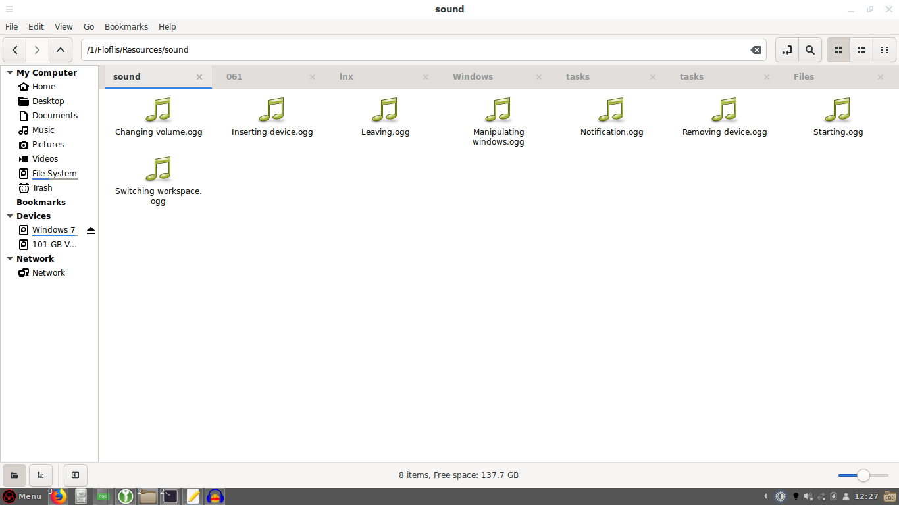
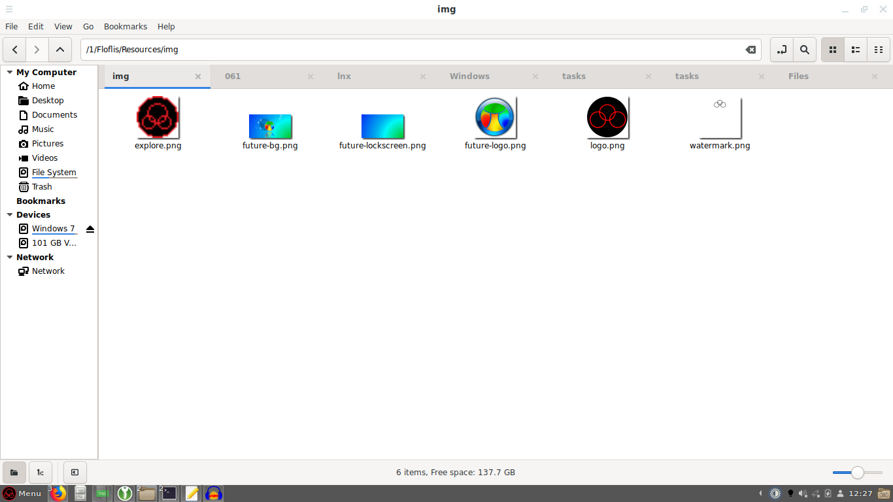

**Note**: this documentation is yet a draft, as Floflis Core isn't available yet.

## Introduction
Maybe you know how the Windows folders are well organized; on contrary of Linux, MacOS and Android.

As root represents the complex structure of a tree, Floflis implemented the tree folder above the root.

**Let the root be used by nerds, and the tree for common users**.

## The tree folder



Tree is a folder named "1" inside the root directory.

While root address is referred as `/`, the tree is `/1`.

Referring to Linux, tree is equivalent to `/home` folder, with write access granted to current user. But unlike on Linux, Floflis is made for personal device with a main user instead of multiple users. On newer versions Floflis will support multiple users with use of authorizations and pendrives.

**Why not to use `/home` folder instead**? Because it is a mess.

## Subfolders



Some folders are original of tree, but others are symlinked (special shortcuts) from `/home` folder.

Also the root is accessible from tree, in the symlinked `Z-root` folder.

### /1/Apps



`/1/Apps` folder contains all user apps.

Only HTML5 apps are added to this folder. Usually they are Electron apps.

### /1/AppsOld



This folder contains classical apps (that aren`t in HTML5) and locally installable.

Other Linux/Debian/Ubuntu apps are also installable, without depending on this folder.

### /1/Games

Contains HTML5 games.

### /1/Books

Contains user`s books, in any format.

Subfolders:

* `/Magazines`
* `/Comics`
* `/Manuals` (using MkDocs format)
* `/Scanned`

### /1/Orgs

Contains user`s organizations.

Hybridly, they are both Peeper pages and Aragon organizations.

### /1/3D

Contains 3D things from user. This folder isn`t yet very organized, as others. Suggestions and pull requests are welcome.

Subfolder:

* `/Objects`

### /1/Fonts

Contains user`s fonts to be used on sites, slide presentations and other writings.

These fonts are in web format (woff, woff2).

### /1/sourcecode

Contains downloaded source codes user want to compile.

### /1/config



Contains all settings that Floflis and other HTML5 apps would need.

A example of contents inside `dat.json`:

```json
{
"type":"config/os",
"url":{},
"lang":"en-us",
"title":"Floflis Settings - floflis",
"user":"floflis"
}
```

### /1/Floflis



This is the system folder.

It haves folders like the tree, except its `/Resources` and `/libs` folder.







`/libs` folder contains [shared libs from Floflis](/dev/#reading-shared-libs).

## Symlinked folders

### Z-root

Magic folder giving access to root from tree.

### Desktop

The same desktop displayed when you login, and as other symlinks, same from `/home` folder.

### Documents

Contains a new subfolder made by Floflis: `/Scanned`.

### Images

Compared to Linux it contains new subfolders:

* `/Photos`
* `/Printscreens` (a friendly meaning for non-english languages)
* `/Drawings`
* `/Scanned`
* `/Memes`
* `/GIFs`

### Music

New subfolders:

* `/Memes`
* `/SFX`
* `/Background`
* `/Voice`

### Videos

New subfolders:

* `/Series`
* `/Movies`
* `/Documentaries`
* `/Animations` (contains the `/Animes` subfolder)
* `/Memes`

### Downloads

New subfolders:

* `/Seeding` (downloaded files you`re seeding on P2P network)

### Templates

Simple symlink, no added subfolders.

## Useful links

* <a href="https://github.com/Floflis/Floflis-linux_x86/issues/58" target="blank">Discussion that introduced tree folder</a>
