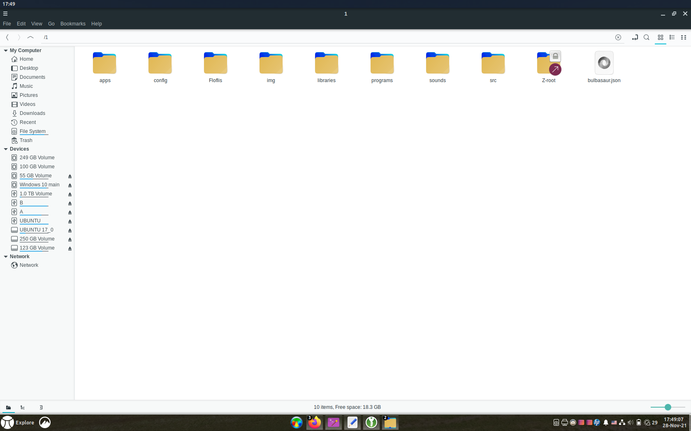
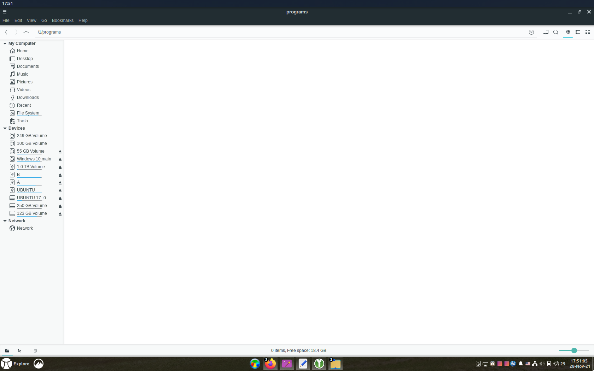
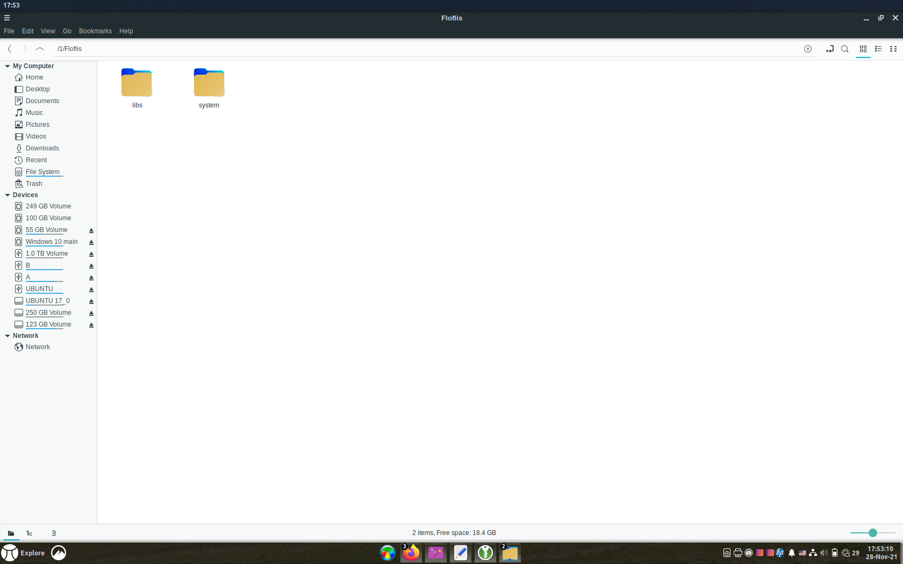

**Note**: this documentation is yet a draft, as Floflis Core isn't available yet.

## Introduction
Maybe you know how the Windows folders are easily organized; on contrary of Linux, MacOS and Android.

Its the small details - that some devs thinks as "insignificant" - what makes an OS pleasant to the normie users.

As root represents the complex, low-level structure of a tree: Floflis have implemented the tree folder above the root.

**Let the root be used by nerds, and the tree for normal users**.

## The tree folder


Tree is a folder named "1" inside the root directory.

While root address is referred as `/`, the tree is `/1`.

Outdated information -->
Referring to Linux, tree is equivalent to `/home` folder, with write access granted to current user. But unlike on Linux, Floflis is made for personal device with a main user instead of multiple users. On newer versions Floflis will support multiple users with use of authorizations and external drives.
<-- Outdated information

## Subfolders



Outdated information -->
Some folders are original of tree, but others are symlinked (special shortcuts) from `/home` folder.
<-- Outdated information

Also the root is accessible from tree, in the symlinked `Z-root` folder.

### /1/apps (Draft, outdated)


`/1/Apps` folder contains all user apps ([.apps](../floflisfiles/#apps) extension).

Only HTML5 apps are added to this folder. Usually they are Electron apps.

### /1/programs (Draft, outdated)



This folder contains classical apps (that aren't in HTML5) and locally installable.

Other Linux/Debian/Ubuntu apps are also installable, without depending on this folder.

### /1/games

Contains HTML5 games ([.game](../floflisfiles/#game) extension).

### /1/html5

Contains HTML5 files ([.html5](../floflisfiles/#html5) extension). They can be simple applications or games.

### /1/personal (Draft, outdated)

Subfolders:

#### profile

User's personal profile (Ethereum, IPFS, social networks).

#### site

User's personal site. If user don't have a non-blog site, the Hugo blog will be the site (so there won't be an need for the "blog" folder.

#### blog

User's personal blog, using Hugo.

This folder is only created if user already do have an non-blog site.

#### data

Contains `tasks` and `issues` subfolders.

#### badges

Contains user's open badges.?

#### projects

User's personal projects.

#### token

User's personal token (Ethereum).?

### /1/books

Contains user's books, in any format.

Subfolders:

* `/magazines`
* `/comics`
* `/manuals` (preferrably MkDocs format, but can have others such as PDF)
* `/scanned`

### /1/orgs

Contains user's organizations (Aragon).?

### /1/3d

Contains 3D things from user. This folder isn't yet very organized, as others. Suggestions and pull requests are welcome.

Subfolders:

* `/objects`
* `/scenes`

`/objects`' subfolders:

* `/voxels`

### /1/libraries


Libraries that user will only use indirectly or sometimes.

Subfolders:

#### /1/libraries/fonts

Contains user's fonts to be used on sites, slide presentations and other writings.

These fonts are in web format (woff, woff2).

#### /1/libraries/replic

De-duplication of files, having only one symlinked in any place it need. Can be used by Dat and IPFS.

### /1/src

Contains downloaded source codes user want to compile.

### /1/config


Contains all settings that Floflis and other HTML5 apps would need. `Apps` and `Games` subfolders contains these data.

An example of contents inside `user.json`:

```json
{
  "name": "daniella",
  "eth": "0xDDfC2e10702d8A781727A34D83B3bb3CA94a3E91"
}
```

Example of contents inside `tokens.json`:

```json
{
  "flof": {
    "polygon": "30970.59",
    "xdai": "30970.63",
    "total": "61941.22"
  }
}
```

`tokens.json` is used only by [Floflis Central](../flofliscentral/) (so it can change, becoming a temporary file).

Example of contents inside `personalization.json`:

```json
{
  "background": "file:///usr/share/backgrounds/warty-final-ubuntu.png"
}
```

`personalization.json` is used only by [Floflis Central](../flofliscentral/) (so it can change, becoming a temporary file).

### /1/Floflis



It's system folder. Haves folders like the tree (`apps`, `html5`, `programs`, `fonts`), except its `/system` and `/libs` folder. There isn't `/games` folder because they should be easily uninstallable.


`/libs` folder contains [shared libs from Floflis](/dev/#reading-shared-libs) and system's `fonts` subdirectories.

## Symlinked folders

### /1/Z-root

Magic folder giving access to root from tree.

### /1/desktop

The same desktop displayed when you login, and as other symlinks, same from `/home` folder.

### /1/documents

Contains a new subfolder made by Floflis: `/scanned`.

### /1/images

Compared to Linux it contains new subfolders:

* `/photos`
* `/printscreens` (a friendly meaning for non-english languages)
* `/drawings`
* `/scanned`
* `/memes`
* `/gifs`
* `/icons`

### /1/music

New subfolders:

* `/memes`
* `/sfx`
* `/background`
* `/voice`

### /1/videos

New subfolders:

* `/series`
* `/movies`
* `/documentaries`
* `/animations` (contains the `/animes` subfolder)
* `/memes`

### /1/downloads

New subfolders:

* `/seeding` (downloaded files you're seeding on P2P network)

### /1/templates

Simple symlink, no added subfolders. Suggestions are welcome.

## Useful links

* <a href="https://github.com/Floflis/Floflis-linux_x86/issues/58" target="blank">Discussion that introduced tree folder</a>
